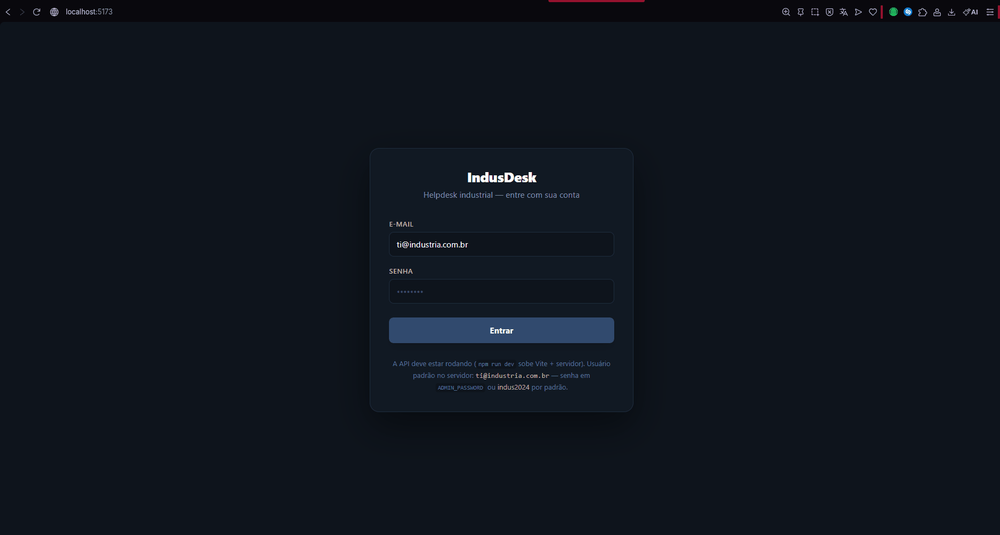

# IndusDesk

**Sistema web de gestão de chamados de TI** com visual industrial: dashboard com gráficos, abertura de chamados, área do técnico, histórico, relatórios e exportação em **PDF** e **Excel (.xlsx)**.

**Desenvolvido por [Danielle Rocha](https://github.com/Daniirocha)**


---

## Em ação

Para mostrar o fluxo no GitHub, grave um GIF curto (ex.: login → dashboard → novo chamado) e salve como **`docs/demo.gif`**. Depois descomente a linha abixo ou adicione:

```html
<p align="center"></p>
```

Ferramentas úteis: [ScreenToGif](https://www.screentogif.com/) (Windows), ShareX, OBS.

---

## Stack

| Camada | Tecnologia |
|--------|------------|
| Front | React 19, Vite, Tailwind (login), Recharts, jsPDF, SheetJS |
| API | Express, SQLite (`better-sqlite3`), JWT, bcrypt |
| Dados | SQLite em `server/data/` (criado ao iniciar a API; não versionado) |

Fluxo: autenticação com JWT, chamados persistidos na API, front consumindo os endpoints.

---

## Como rodar

**Requisito:** [Node.js](https://nodejs.org/) 20+

```bash
npm install
npm run dev
```

Sobe o **Vite** e a **API (porta 4000)**. Acesse a URL do Vite (geralmente `http://localhost:5173`).

```bash
npm run dev:client   # só front
npm run dev:api      # só API
npm run build        # build de produção do front
npm run preview      # pré-visualizar build (API precisa estar ativa ou configure VITE_API_URL)
```

---

## Acesso inicial

Na primeira execução a API cria o usuário admin e os chamados de exemplo:

| | |
|--|--|
| E-mail | `ti@industria.com.br` |
| Senha | `indus2024` |

**Servidor (opcional):** `ADMIN_EMAIL`, `ADMIN_PASSWORD`, `JWT_SECRET`, `PORT`, `INDUS_DB_PATH`  
**Front (opcional):** `VITE_API_URL`, `VITE_DEFAULT_EMAIL`

---

## Estrutura

```
Indus-Desk/
├── server/       # API + SQLite + seed
├── src/          # React (IndusDesk, Login, api, auth…)
├── public/
└── package.json
```

Arquivos gerados localmente (`node_modules`, `dist`, `.env`, `*.db`) estão no `.gitignore`.

---

## Repositório

[github.com/Daniirocha/Indus-Desk](https://github.com/Daniirocha/Indus-Desk)
